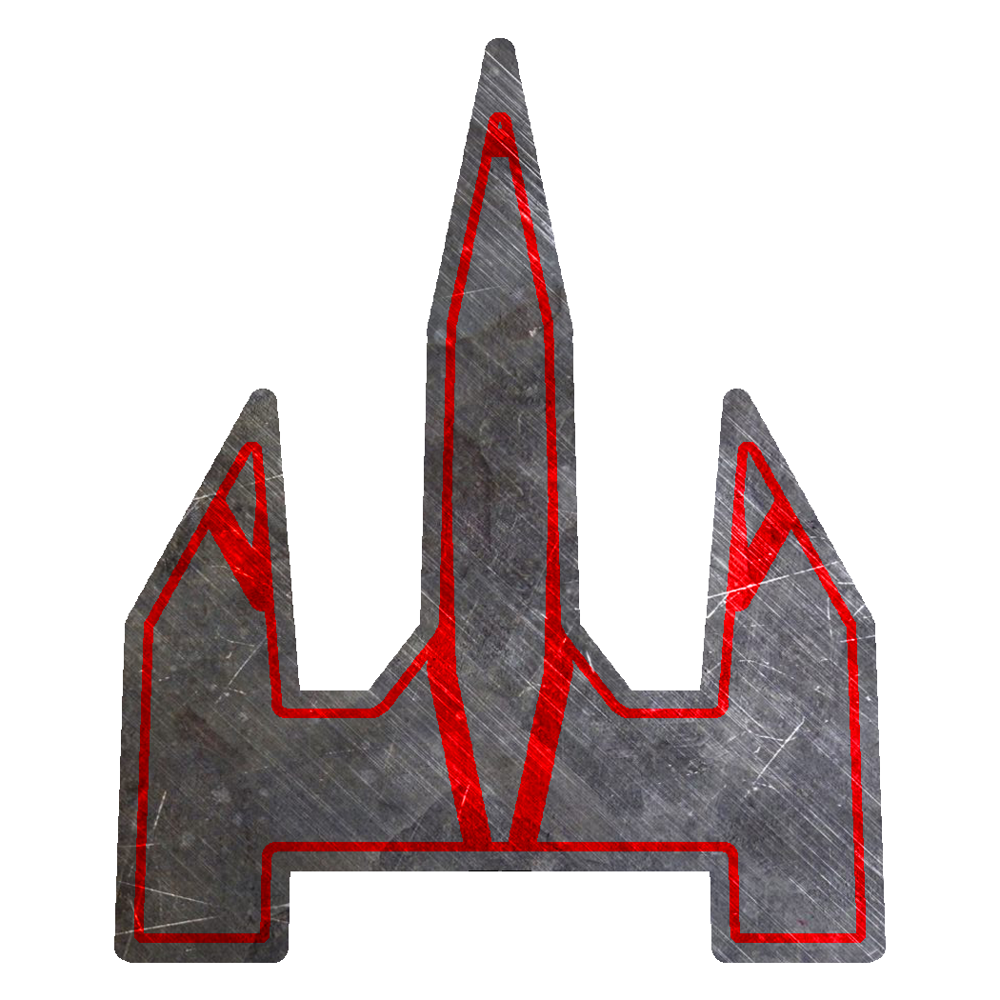

# Welcome to my blog! 

This is mostly dedicated for logging my development on a game called **[Techiton](https://techiton.net)**. 
* * *

* * *
I've largely found myself unsatisfied with modern RTS games. In the last ten years and had come to the conclusion that they are simply too complex but at the same time, unflexable. Total Annihilation allowed you to **not** be rooted to a specific area for resources on the map, besides the (infinite) metal collection nodes that are limited by the Tech level for Metal extraction rate.

I believe this is part of what made that game great. Energy could be made just about **anywhere** around the map. With only two resources (three, if you count "Unit Build Time") and complete flexibility of rooting your base anywhere in the map is something under appreciated.

Problem is that most modern RTSs involve too much micro-play. Supreme Commander thought too big, and Starcraft II makes your base a sitting duck on static points around the map with too many resource restrictions. I don't believe this encourages much flexibility in play or strategy.

**Simplicity is key.** A lot of strategy is already pretty involved by making decisions on the number of certain units, where to place them, where to make factories and defensive structures alone. Adding spells to certain units convolutes things despite how satisfying it can sometimes be.

Also it's a real struggle for anyone to run totalA on a modern system without hurdles.

And that's why I'm working on this game! 

Have ideas or want to help? Email me at nulsoro@gmail.com or message me on discord (Nulsoro#0950)!
Or, join the discord [here](https://discord.gg/eQHx4Rv).